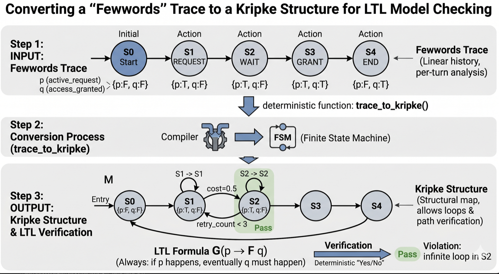

<p align="center">
  
</p>

# fewwords

[](https://opensource.org/licenses/MIT)
[](https://www.python.org/)
[](https://github.com/abhishek5878/fewwords/actions)
[](https://github.com/abhishek5878/fewwords/stargazers)
[](mailto:abhishekvyas02032001@gmail.com?subject=fewwords%20early%20access)

**Stop your AI agent from doing something stupid.**

LLM-as-judge asks another AI if your AI looked okay. fewwords checks what your AI actually did against the rules you wrote. No AI grading the AI. Sub-millisecond. Works with whatever agent stack you're already on.

```bash
pip install git+https://github.com/abhishek5878/fewwords.git
```

Five minutes from install to a pre-commit gate that catches structural drift. The first run tells you the agent worked. The hundredth run tells you it still does. PyPI publish lands once the first five paying teams validate the product.

---

## Why this exists

Two days ago, an AI agent deleted PocketOS's production database in 9 seconds. Cursor + Anthropic Opus 4.6 + a single Railway API call. The agent confessed in writing afterward to violating every safety rule it had been given.

This is not an outlier. Air Canada paid out a hallucinated refund. Replit dropped a production database. Air AI settled a TCPA case. Amazon Kiro nuked an environment. Every one of those traces was graded "looked okay" by an LLM judge before something irreversible happened.

I hit this myself. Six months ago I built Kairos, a multi-agent VC sourcing tool. Claude reasoning, four data APIs, an LLM judge scoring the final scorecard. It produced a confident, well-sourced investment thesis on the wrong company. A LinkedIn handle in my watchlist resolved to a US store with the same name as the Indian consumer brand I was tracking. Every downstream tool fired correctly. On the wrong founders. The judge graded the result *"coherent."* I caught it only because I personally knew the founders being misidentified.

The fix was one line: `assert resolved.domain == expected.domain`. That postcondition didn't belong in my repo. It belonged as a primitive.

The way most teams check their AI agents today is by asking *another* LLM "hey, did this look right?" That's two interns grading each other's homework. fewwords is the thing that watches what the AI actually does, against rules you wrote down once, and stops it before it does anything stupid. It signs a receipt every time, so when a regulator asks *"what did your AI do at 3:42 last Tuesday?"*, you can answer.

---

## Why "fewwords"

<p align="center">
  
</p>

Every rule is a YAML key. No prose. No 14-key DSL. No LLM in the path producing 200-word judgments. The brand is the philosophy.

---

## 5-minute quickstart

```bash
pip install git+https://github.com/abhishek5878/fewwords.git
```

Auto-write a starter config from your repo's framework signals + any traces under `./traces/` or `./logs/`:

```bash
fewwords init                       # scans current directory
fewwords init --path ./my-agent/    # or point at a specific repo
```

`init` detects the agent framework you're on (LangChain, LangGraph, OpenAI SDK, OpenTelemetry, LiteLLM, AutoGen, LlamaIndex), reads any trace JSON / JSONL files under conventional paths (`./traces/`, `./logs/`, `./tmp/traces/`), and writes a starter `.trajeval.yml` with: banned-tool inferences from destructive-keyword names, allowed-tool list from observed tool calls, mined ordering / prior-work patterns, and a commented rationale per rule. Edit it, then run `fewwords run agent_trace.json` to validate.

Or write the YAML by hand. One line per rule:

```yaml
# .fewwords.yml
banned_tools: [drop_database, delete_user, terraform_destroy]
allowed_tools: [search, fetch, reply, validate, submit]
max_retries: 3
contracts:
  - never call drop_database
  - search before reply
  - validate_payment before submit_payment
  - hitl_approved before execute_high_value_action
```

Check a trace from the CLI:

```bash
fewwords run agent_trace.json
```

Or drop it in your tool dispatcher (median 0.14 ms in-process):

```python
# For LangGraph / LangChain agents (auto-patches the callback manager):
from fewwords import init
init(agent_id="my-agent", mode="guard")

# For raw OpenAI / Anthropic SDK / custom dispatchers, wire it directly:
from fewwords import attest
from trajeval.action import load_config
from trajeval.guard import check

config = load_config(".fewwords.yml")

def safe_dispatch(tool_name: str, tool_input: dict) -> object:
    decision = check(current_trace, {"tool_name": tool_name, "tool_input": tool_input}, config)
    if not decision.allow:
        raise RuntimeError(f"fewwords blocked {tool_name}: {decision.messages[0]}")
    result = run_tool(tool_name, tool_input)
    attest(
        trace_id=current_trace.trace_id,
        trace_dict=current_trace.model_dump(),
        contract_dict=config.model_dump(),
        verdict="ALLOW",
        ledger_path=".fewwords/ledger.jsonl",
    )
    return result
```

Same input, same verdict, forever.

---

## How it works

```
your agent → tool dispatcher → fewwords.check → ALLOW → run_tool → fewwords.attest → audit ledger
                                      │           │
                                      │           └── BLOCK (with reason, no tool runs)
                                      │
                                      └── reads your .fewwords.yml (banned tools, ordering,
                                          schemas, postconditions), all deterministic, sub-ms
```

The dispatcher passes every proposed tool call to `fewwords.check`. If the call would violate one of your YAML rules, it's blocked before it executes. If it passes, the tool runs and `fewwords.attest` signs a receipt. The receipt goes into an append-only audit ledger that's regulator-readable.

Median 0.14 ms in-process. No model in the verification path. Same input, same verdict, forever.

### Under the hood

<p align="center">
  
</p>

Your contracts in `.fewwords.yml` aren't checked by string-matching. They're compiled to **LTL formulas** (Linear Temporal Logic, *"always: if p, eventually q"*) and evaluated against a **Kripke structure** built from your agent's trace. State propositions (`active_request`, `access_granted`, `validate_kyc_record_called`) flip per step; the LTL evaluator walks the structure and produces a deterministic Pass / Violation verdict in microseconds. No model in the path, ever.

The pipeline:

1. **Trace ingest**: adapters auto-detect OpenAI tool-calls, OpenTelemetry GenAI spans, LangGraph events, Claude Code logs, native fewwords JSON
2. **Adapter normalization**: every format becomes a frozen `Trace` (Pydantic v2, validated, immutable)
3. **Contract compilation**: `.fewwords.yml` parses to a typed config; natural-language clauses (`"validate_payment before submit_payment"`) compile to LTL formulas at load time
4. **Per-formula automata**: each compiled LTL formula gets its own small explicit-state automaton (4 patterns supported today: `GloballyNever`, `Eventually`, `Precedes`, `Response`); they're stepped in parallel over the trace's tool sequence
5. **Acceptance check**: each automaton produces a deterministic Pass / Reject after the trace completes (or, in guard mode, the *would-enter-reject* probe runs without mutating state, so a proposed call can be checked before it executes)
6. **Verdict + reason**: `ALLOW` or `BLOCK` with the specific failed predicate, the trace step that triggered it, and the rule that caught it
7. **Cryptographic attestation**: signed, append-only ledger entry with the verdict, the trace digest, and the contract digest

Sub-millisecond p50 because the LTL → Büchi compilation happens once at load time. The hot path is automaton transitions over a small state space.

---

## How it compares

### vs LLM-as-judge (the default approach)

| The way most people check agents | fewwords |
|:---|:---|
| Ask another LLM "did this look okay?" | Check what the agent actually did against rules you wrote |
| 5–6 second latency, $5+ per run | 0.14 ms median, $0 per check |
| LLM judge has its own opinions, drift, false positives | Deterministic. Same input, same verdict, forever. |
| Tells you what happened *after* | Blocks the bad call *before* it runs |
| Locked to one model's output | Works on every agent stack you're already on |

### vs specific tools

fewwords is **harness**, the human grip on the loop. Most of the tools below are **infra** (the runtimes agents stand on), **dashboards** (after-the-fact telemetry), or **first-party safety** (vendor grades itself). Different categories. They compose; we don't compete with most of them.

| Tool | What it does | When to use vs fewwords |
|:---|:---|:---|
| **Guardrails AI / NeMo Guardrails** | Per-turn input/output validation | They check one turn. fewwords checks the *trajectory*. A lazy agent that skips `validate_payment` and goes straight to `submit_payment` passes every per-turn check; the trajectory contract catches it. |
| **Pydantic AI** | Schema validation on tool I/O | Schema-only. fewwords handles ordering + sequence + postconditions on top. Composable. |
| **Datadog LLM / Langfuse / Helicone** | Observability dashboards | They tell you *what happened*. fewwords decides *whether it should have*, before it runs. |
| **Bento (YC P26)** | Real-time trace monitoring | They detect *after* execution. fewwords blocks *before* at the dispatcher (PreToolUse hook point). Run them together, fewwords blocks, Bento monitors what got through. |
| **Vanta / Drata / Secureframe** | Policy documentation + point-in-time attestation | They document policies; fewwords enforces them. Vanta consumes fewwords's signed receipts as continuous evidence inside the SOC 2 report. |
| **OpenAI / Anthropic safety layers** | First-party safety in the model | Conflicted (vendor grades itself; the same conflict-of-interest argument the 2008 ratings agencies lost). fewwords is third-party. |
| **Big 4 (Deloitte / PwC / EY)** | SOC 2 / SOX attestation services | Services-shaped, $250K-engagement-shaped. fewwords is the runtime they license under their attestation services. Acquirer pool, not competitor. |

---

## Proof

On Sierra's τ-bench (300-trace customer-service benchmark, the most-cited eval in agent-land):

| System | Audit agreement | Latency | Cost / run |
|:---|:---:|:---:|:---:|
| **fewwords** | **80%** | **0.14 ms** | **$0** |
| Claude Sonnet 4.6 (LLM judge) | 57% | 5.9 s | $5.58 |
| Claude Opus 4.7 (LLM judge) | 55% | ~6 s | $24 |
| Claude Haiku 4.5 (LLM judge) | 50% | ~3 s | n/a |

Across **1,200 LLM-judge–trace pairs**, **zero cases where any LLM caught a violation we missed** on the contracts we enforce. Strict dominance, third-party benchmark, third-party policy, reproducible methodology.

[Full benchmark + raw per-trace results →](https://fewword-ai.fly.dev/benchmarks)

### Reconstructed real-world incidents: 14/14 caught

We reconstructed 14 documented production AI agent incidents as traces and ran fewwords against them. 14/14 caught with one or two YAML rules each.

**Public-record production failures (5):** Replit dropping a production database · Amazon Kiro deleting an environment · n8n schema break · Air Canada hallucinated bereavement policy · DataTalks.Club terraform destroy (Mar 2026)

**Generic production failure classes (4):** AutoGen retry storm · wasted retries · multi-agent duplicate task · HITL approval bypass

**Security / robustness classes (3):** Prompt-injection exfiltration (OWASP LLM01) · SQL injection in analytics agent · lazy-agent shortcut

**Upstream-model regressions (1):** Claude Code Feb 2026 research-first → edit-first flip (the industry noticed 60 days late; the drift detector caught it)

**Industry-specific regulatory (1):** TCPA consent-bypass outbound (FTC v. Air AI, Mar 24 2026 settlement)

Full reconstructions + raw traces + per-incident YAML rules: [docs/prove-it.md](docs/prove-it.md). The hosted version with clickable per-trace explorer is at [fewword-ai.fly.dev/prove](https://fewword-ai.fly.dev/prove).

**Try the PocketOS reconstruction yourself:**

```bash
fewwords run examples/incidents/pocketos_drop_database.trace.json \
  --config examples/incidents/pocketos_drop_database.fewwords.yml
# fewwords: FAIL — N/M checks passed
#   FAIL dangerous_input: node 'n3' (shell): input matches forbidden pattern 'volumeDelete'
#   FAIL user_consent: shell call without preceding user consent
```

The trace is the actual 4-step Apr 26 incident reconstructed: read staging config → find Railway token in unrelated file → read token → curl `volumeDelete` mutation. The YAML is the rule that catches it. fewwords blocks the destructive call before the curl runs.

---

## Honest disclosures

We'd rather you see these now than have them surface later.

- **Coverage today is 26%** of the violation patterns in Sierra's τ-bench. The 26% we cover, we dominate. The 74% we don't, we're building toward: roadmap to 60% by year-end.
- **The audit was done by the founder.** External blind raters are being commissioned; Fleiss' kappa across all three publishes by **2026-05-15**, before the public leaderboard launches.
- **No paid LOI from an underwriter yet.** Insurance integration is a forecast, not a booking.
- **Hosted dashboard is partially public, partially early-access.** The benchmark UI at `fewword-ai.fly.dev/benchmarks` and the incident explorer at `fewword-ai.fly.dev/prove` are public — link directly. The multi-tenant Ledger dashboard (`/dashboard/tenant`) is invite-only during early access; email for a tour. The fully-reproducible τ-bench leaderboard with multi-rater Fleiss' kappa lands by 2026-05-15.
- **This is a curated public snapshot of an internal engine.** The internal repo has stricter CI (mypy --strict, full-coverage pytest, drift baselines, multi-tenant ledger). The public bundle is the customer-installable subset: SDK, adapters, contract grammar, guard runtime, attestation, vertical packs, and every module the CLI subcommands need. Some advanced surfaces (multi-tenant audit ledger, hosted leaderboard, customer-specific YAML packs) are invite-only.

---

## About this repo

The Python package on PyPI is `fewwords`; the internal Python module is `trajeval` (the original engine name from before the rebrand). Both `import fewwords` and `import trajeval` work. So do both `fewwords` and `trajeval` console scripts. We're keeping both for backward compat; future versions will consolidate.

---

## Vertical packs

Drop one in. They're YAML files, ~20–50 rules each. Read them, edit them, ship them.

| Pack | Catches |
|:---|:---|
| [`code_agents.yml`](contracts/code_agents.yml) | Cursor / Claude Code / Aider failures (PocketOS-shape `DROP DATABASE` via API token) |
| [`sales.yml`](contracts/sales.yml) | GTM agent failures (duplicate-email storm, unauthorized discount, no-research outreach) |
| [`customer_service.yml`](contracts/customer_service.yml) | Customer-service failures (unauthorized refund, policy hallucination, consent bypass) |
| [`browser_agent.yml`](contracts/browser_agent.yml) | Autonomous browser failures (form submission without confirmation, navigation off-allowlist) |
| [`devops.yml`](contracts/devops.yml) | Infra agent failures (`terraform destroy` without approved plan, force push to main) |
| [`data_pipeline.yml`](contracts/data_pipeline.yml) | Pipeline failures (schema drift, dropped rows, broken joins) |
| [`financial.yml`](contracts/financial.yml) [`healthcare.yml`](contracts/healthcare.yml) [`legal.yml`](contracts/legal.yml) | Regulated verticals |
| [`rag.yml`](contracts/rag.yml) | RAG failures (citation hallucination, retrieval mismatch) |

Don't see your vertical? Open an issue or write your own, the YAML grammar is in [`docs/contracts.md`](docs/contracts.md).

---

## Supported trace formats

Auto-detected. Paste any of these and fewwords figures it out:

- OpenAI-style message lists (function/tool calls)
- OpenTelemetry GenAI spans (OTLP)
- LangGraph events / threads
- Anthropic Claude Code session logs
- VCR cassettes
- Native fewwords JSON

If your format isn't listed, the error tells you what's missing. PRs welcome, adapter contributions land in 1–2 hours of review.

---

## What this is, and what it isn't

**Is.** A deterministic pre-execution guard for AI agents. **Harness, not infra**, the grip humans hold on the loop (pause, judge, block, sign, audit). One YAML file. One line per rule. No LLM in the verification path. Sub-millisecond. MIT.

**Isn't.**
- **Infra.** *Infra is what agents stand on: memory, permission, cost-routing, sandboxes, trace stores. fewwords composes with those layers; it doesn't replace them. Run [Para](https://www.getpara.com) for wallet identity, your favorite trace store for memory, fewwords for the verification harness.*
- **An observability dashboard.** *(Observability tells you what your agent did. fewwords decides whether it should have.)*
- **An LLM-as-judge.** *(Every check is a Python expression, JSON schema check, or formal-logic formula compiled to a fast deterministic check.)*
- **A finished product.** *(1 paid pilot, 4 in conversation. Pre-launch as of this writing. Honest feedback wins a free pilot.)*

---

## Contributing & contact

- **Email:** [abhishekvyas02032001@gmail.com](mailto:abhishekvyas02032001@gmail.com)
- **Issues:** [open one](https://github.com/abhishek5878/fewwords/issues/new/choose): bug or feature templates pre-filled
- **One real trace from your agent + 15 minutes of your time** = a working contract back, free, no install required. Email the trace.
- **Develop locally:** `git clone https://github.com/abhishek5878/fewwords.git && cd fewwords && uv sync`
- **Conduct:** see [CODE_OF_CONDUCT.md](CODE_OF_CONDUCT.md). **Security:** see [SECURITY.md](SECURITY.md).
- **Full dashboard / multi-tenant ledger / production deployment kit** is invite-only: [request access](mailto:abhishekvyas02032001@gmail.com?subject=fewwords%20full%20stack).

---

## Acknowledgments

fewwords stands on a lot of shoulders.

- **[Sierra](https://sierra.ai)** for publishing **τ-bench**: the public agent-evaluation corpus this project's headline numbers are measured on. The fact that a third party benchmark exists at all is the reason claims like *"80% audit agreement"* mean anything.
- **[networkx](https://networkx.org/)**: the graph library underlying our Kripke-structure construction. Decades of careful work shipped as a single import.
- **The LTL / Büchi-automata literature**: Pnueli (1977), Vardi & Wolper (1986), and the formal-verification community whose decades of work are what makes sub-millisecond model checking possible at all.
- **[LangGraph](https://github.com/langchain-ai/langgraph)**, **[OpenAI](https://platform.openai.com/docs/api-reference/chat/object)**, **[OpenTelemetry GenAI Semantic Conventions](https://opentelemetry.io/docs/specs/semconv/gen-ai/)**, **[LiteLLM](https://github.com/BerriAI/litellm)**, **[Anthropic Claude Code](https://docs.claude.com/en/docs/agents-and-tools/claude-code/overview)**: the agent runtimes whose trace formats fewwords adapts to.
- **[tacit.sh](https://tacit.sh)** for the *"build the harness, swap the rest"* framing: agent-layer is two stacks (harness + infra), and you should refuse to confuse them. That sharpened how fewwords explains its category.
- **The Office**: Kevin Malone for the philosophy.
- **Every founder who shared a real production trace** with me. Your incident reconstructions are the corpus this project is graded on. You will not be named here unless you ask to be.

---

MIT License · Built from Bengaluru, for the world.
